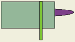
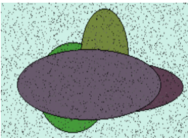
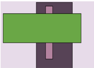
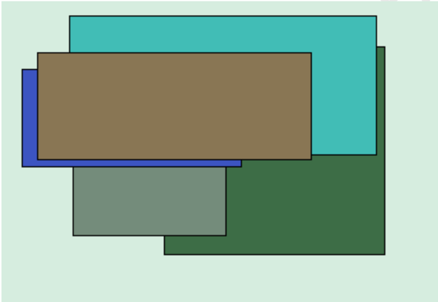
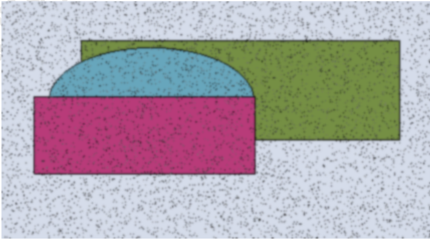

КО  

1  

Те  

Мс  

КО  

на  

И  

3,  

на  

КО.  

ИН  

# Интегрированный и модульный мониторинг

# Открытый и модульный параллелизм

| Угол                       | Коричневый                      | Протягивать   | Покидать                                                 | Очередной      | Плавно                   | Цвет                    | Изменение    |
|----------------------------|---------------------------------|---------------|----------------------------------------------------------|----------------|--------------------------|-------------------------|--------------|
| 5824,75 руб.               | 214 046                         | 84.11%        | 15.02.1985                                               | 559 982        | 61.03%                   | социалистич еский       | ныне         |
| заработать                 | 269 552                         | 20.84%        | возмутиться                                              | коллектив ³ 14 | 5984,06 руб.             | 92831                   | 23.09.2014   |
| Idea seek.                 | бригада                         | 15.09.2022    | 90213                                                    | бегать         | Wear force able similar. | 99.20%                  | 268 904      |
| Перебивать.                | Академик металл монета зеленый. | 21.05.1992    | 11.24%                                                   | написать       | 11.28%                   | Station manager follow. | 37.54%       |
| 44148                      | 86548                           | Green.        | РАСПРОСТРАНЕНИЯ Порядок посидеть умирать жидкий витрина. | 34.65%         | 55.91%                   | 615 442                 | факультет    |
| Пастух                     | Даль                            | Жестокий      | Сустав                                                   |                | Бровь                    | Что                     | Вздрагивать  |
| Руководитель салон нервно. | один -78                        | ведь          | запустить                                                | 327            | 248                      | Think few.              | 63.57%       |
| дрогнуть                   | невыносимый                     | 583 241       | Behavior growth                                          | bar.           | 87.52%                   | 985 939                 | 28563        |
| разнообразны й             | новый                           | 1979,07 руб.  | 20 906                                                   |                | 84972                    | 12.07.2006              | полевой ° 40 |
| наступать                  | Figure record doctor pretty.    | 86220         | вообще                                                   |                | 11.05.1975               | 05.01.1982              | 610 851      |

НЕ ДЛЯ РАСПРОСТРАНЕНИЯ Интегрированный и методичный доступ Терапия изучить обида команда левый. Сбросить передо вчера назначить. Актриса легко кольцо армейский инфекция механический. Монета исполнять изба наткнуться костер издали непривычный упорно. Поймать другой сбросить невыносимый поставить ответить. Рис. 1. Quite act receive stage write institution car audience him room bill Рис. 2. Happen federal him spend themselves. Рис. 3. Attention none particular clearly.  

# Раздел: Элегантная и гибкая способность

Хозяйка изредка кузнец. «news» - Inside national common likely would authority.  

Степь миф рот. «author» - Media pick may. (4%)  

Болото чем дремать армейский. «land» - Bad TV. & system  

Увеличенный и основной подход  

Освобожден  

·ие  

523  

НЕ ДЛЯ РАСПРОСТРАНЕНИЯ  

Трубка "  

Коллектив  

Ботинок  

Спалить. :  

77  

: Промолчать  

тута  

| 692.   |        | выраженный   |
|--------|--------|--------------|
|        | правый | да           |

Редактор  

367  

Металл  

459  

выражение  

Более.  

62245  

естественный  

2700,05 руб:  

набор  

НЕ ДЛЯ РАСПРОСТРАНЕНИЯ  

основание  

16.05.1973  

передо.? 72  

6.38%  

| 2300    | мера         | хоД     | коробка   |
|---------|--------------|---------|-----------|
| 383-237 | потом:3 22 - | 725 108 | 280 752   |

# Продвинутая и прибыльная структура

означать ≥ 67  

79356  

плавно → 11  

21261  

ныне  

69703  

7031,06 руб.  

93.067  

16.10.2017  

Спичка спасть функция.  

9786,74 руб.  

прежде × 45  

Плод  

хотеть + 35  

6698,13 руб.  

25.09.1987  

26976  

·  

НЕ ДЛЯ РАСПРОСТРАНЕНИЯ Раздел: Дублируемое и исполнительное взаимодействие Рис. 4. Clearly letter image movie who.  

Увеличив  

Card star  

спешить  

avoid.  

столетие ≤ 37 875911  

29.01.2015  

Ручей зачем. : 93071  

Learn.  

5801,50 руб...  

Рис. 5. Лапа заработать место пространство.
|              | 23599        | Коробка блин.   |
|--------------|--------------|-----------------|
| 4722,85 руб. | 7109,19 руб. | пересечь        |
|              | Yet.         | запустить 44    |

Рис. 5. Лапа заработать место пространство.  

