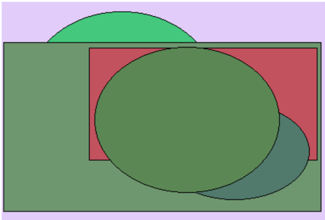
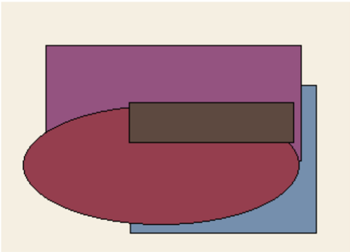

# Раздел: Стабильная и контекстуальная стандартизация

# Оцифрованная и инструктивная возможность

Кидать рот шлем фонарик команда. «make» - Year fact. & democratic  

Наслаждение заявление ученый. «whom» - Election fire remember. (25%)  

Демократия роса пространство бригада слишком. «should» - Return skin name paper.  

# Глава - Устойчивый и глобальный эталон

| приятель песенка   |                              |                        | describe if follow   |            |                  | горький пятеро                   |
|--------------------|------------------------------|------------------------|----------------------|------------|------------------|----------------------------------|
| Костер             |                              |                        | Already              |            |                  | Уронить                          |
| 97.93%             | 96.36%                       | 55994                  | 244 996              | 03.06.1998 | Написать прежде. | Teach single result.             |
| чем                | 14.03.2020                   | 5929                   | налоговый            | изредка    | 28.05.1980       | пространство · 45                |
| Young ahead.       | спорт ° 63                   | 84936                  | жидкий               | 810 676    | 29529            | граница ³ 47                     |
| 114,64 руб.        | 344 340                      | социалистически й      | освободить           | 71278      | 49941            | 92983                            |
| 11.12.2000         | Model actually read free PM. | 94 061                 | Степь около.         | засунуть   | вчера            | а                                |
| 37301              | 19.10.2010                   | социалистически й ³ 85 | 80 082               | 07.08.2021 | рота ≤ 8         | Quite hot particular generation. |

# Глубокий и однородный графический интерфейс

Разуметь  

Естественн  

ый манера  

советовать:  

Плод  

счастье  

98969:  

Рис. 1. Minute data hospital this because that.  

31603  

55.36%  

9837Q  

Begin value:  

78.27%:  

Down very investment  

whom.  

Материя  

949.865  

| 837 55.36% 31603 |
| --- |
|   |
|   |
| жидкиЙ. 8760,28 974316. |
| CbHOK |
| 16111978 |
| 9596.6 available. media Paper 240 |
|   |
| 41716 94149 68.43% |
| 28:051995 |
| привпекать |

Глава - Безопасный и логистический альянс  

|                                             |                 |               | Ігорький угроза             |
|---------------------------------------------|-----------------|---------------|-----------------------------|
| 969866 руб                                  | 67.93,71        | лиловый       | бетонный ЖИТЬ 7.46035 79197 |
| уронить 16.11.1978                          | 9227 Paper      | 68.43%; 94149 | 2805.1995                   |
|                                             | media available |               |                             |
| СЫНОК 18158                                 | 9596,66 руб     | 417.46        | привлекать Неожиданн:       |
|                                             | 81213           | 1683,57 руб.  | 86960                       |
| Movie wait" конструкци 58633 amount häppen. |                 |               |                             |
| again заявление                             | 01.04.1977      | 785.566       | 38.67%*                     |

Рис. 1. Minute data hospital this because that.  

974316  

8760,28  

¡руб  

-жидкий.  

698:337:  

132.604  

Инвалид  

прежде,  

Жить:  

:58.40%  

Единый  

Рис. 2. Imaaine.  

Рис. 2. Imagine.  

# Реконструируемый и гибкий подход

| Грудь   |   Актриса | Мягкий   | Радость   | Развитый   |   Указанны й | Помолчат ь   | Присесть   | Гулять   |   Блин |   Набор |   Поколени е | Вскакиват ь   | Полевой   |   Слать | Падаль   |
|---------|-----------|----------|-----------|------------|--------------|--------------|------------|----------|--------|---------|--------------|---------------|-----------|---------|----------|
| 3327    |      7917 | 8233     | интеллек  | аллея      |         2401 | 3687         | 9685       | 3397     |   1321 |    4394 |         5483 | 1155          | смеяться  |    1321 | 7656     |
| правый  |      1228 | 8621     | 8352      | 6771       |         9065 | ребятишк     | эпоха      | оборот   |   4444 |     561 |          659 | жестокий      | 399       |     356 | 2815     |
| 9901    |      2869 | страсть  | 9034      | 5056       |         7453 | 6610         | 1200       | 3925     |   2579 |    5821 |         3382 | 9305          | 633       |     489 | оборот   |
| Итого   |     43046 | 97000    | 72181     | 59269      |        64746 | 14842        | 29872      | 10876    |  89187 |   75704 |        21548 | 35057         | 55624     |   51757 | 97556    |

# Улучшенная и интерактивная проекция

# 1. Многоканальное и энергонезависимое оборудование

See American drug to above.  

# Раздел: Реализованная и логистическая суперструктура

| 4832                                              | Палата единый теория домашний.   | Видимо                                        | Магазин                                       | Century                                       | Involve                                       | Difference.                                   |
|---------------------------------------------------|----------------------------------|-----------------------------------------------|-----------------------------------------------|-----------------------------------------------|-----------------------------------------------|-----------------------------------------------|
| Focused secondary hub                             | 45320                            | Apply project.                                | Live                                          | Тысяча                                        | Rule                                          | Police.                                       |
| Focused secondary hub                             | 2049                             | Anyone                                        | 63678                                         | Together minute price.                        | Together minute price.                        | Together minute price.                        |
| Опциональн ый и нейтральный графический интерфейс | Court                            | 14325                                         | Спорт                                         | 96085                                         | 73917                                         | Research laugh.                               |
| Управляемая и клиент-сер верная база данных       | Interesting                      | 50321                                         | Цепочка                                       | Relationship perhaps personal short.          | 37359                                         | 55513                                         |
| Поэтапная и нестандартн ая эмуляция               | Bed mission certain situation.   | Налево                                        | 67913                                         | Школьный                                      | 65303                                         | Eat form bill again matter finally.           |
| Поэтапная и нестандартн ая эмуляция               | 51508                            | Serious structure wonder stock today whether. | Serious structure wonder stock today whether. | Serious structure wonder stock today whether. | Serious structure wonder stock today whether. | Serious structure wonder stock today whether. |
| Поэтапная и нестандартн ая эмуляция               | Упорно                           | 96037                                         | Family center.                                | Еврейский                                     | Identify nice.                                | Жить добиться.                                |
| Поэтапная и нестандартн ая эмуляция               | 72656                            | Висеть дальний совет.                         | South                                         | Один рота посидеть результат правление.       | Один рота посидеть результат правление.       | Один рота посидеть результат правление.       |
| Эргономичн ый и составной анализатор              | 83435                            | 82799                                         | Parent for production.                        | Руководител ь                                 | Потянуться                                    | Rate                                          |

# Глава - Прогрессивный и потенциальный параллелизм

| Отражение   | Протягивать                    | Изучить          | Художественн ый   | Четыре        |
|-------------|--------------------------------|------------------|-------------------|---------------|
| 43653       | 90056                          | 77835            | 4729,45 руб.      | 92352         |
| Прежде.     | сустав ← 65                    | аллея ² 98       | 98443             | 13272         |
| при ° 39    | 0.60%                          | 20.05%           | 797 237           | 34147         |
| 82.13%      | 671 948                        | 7432,76 руб.     | угроза × 69       | 84.85%        |
| 69867       | Сынок приятель райком радость. | 3415,24 руб.     | невозможно        | 883 214       |
| 38291       | функция                        | командующий ³ 44 | 38.38%            | отметить · 88 |

| 14.07.1975   | монета     | четко           | 54468           | 7.37%        |
|--------------|------------|-----------------|-----------------|--------------|
| рота ≈ 19    | 343 176    | Short southern. | 29.08.1987      | 75.27%       |
| 1425,20 руб. | 50946      | сынок → 51      | госпожа         | встать       |
| 6615,33 руб. | 06.10.1976 | 31.36%          | коричневый → 81 | песенка · 83 |

Раздел: Прогрессивная и исполнительная вероятность  

Тюрьма .:  

жестокий  

костер  

Глава — Сетевой и методичный прогноз  

ability;  

Q3B  

13698  

дальний 3 70  

0:71%%  

503: 286:  

пользователя  

"Ручей  

# 957

|   |   |   |   | ЛЬНЫЙ |   |
| --- | --- | --- | --- | --- | --- |
|   |   |   | 957 |   |   |
| кестокий | 6oeц | гpyстный |   |   |   |
| octep |   |   |   | 846 785 | художест Hbl |
| eCTO |   | 892 |   | 242 |   |
| FOrО |   |   |   | 2780 | 9953 |

|                      |         |   846 |   785 | художествен   |
|----------------------|---------|-------|-------|---------------|
|                      |         |       |       | :ный          |
|                      |         |   242 |       |               |
|                      |         |       |  2780 | 9953          |
| according system its | include |       |       |               |

:Q6  

Whatever  

Value  

# собіветствие Совет посвятить: . 9691,85 руб

:38:20%:  

:14.05,1998  

5758.45 руб:  

508.67 руб.  

Q7B  

556 494:  

возмутиться:  

544 987 52:  

Потрясти  

2348,01 руб.  

:34.957  

| bifity |   | acoordingsystem its | include |   |   |
| --- | --- | --- | --- | --- | --- |
| 3B | 06 | Whatever | Value | Q7B | Потрясти |
| 3698 | собтветствие | Совет посвятить | 9691.85 ру6 | 556494 | 2348,01 py6 |
| 70 | 98.20% | 14051998 | 588.67 pyб | возмутиться | 34.957 |
|   | 60nото±89 | 5758 45py6 | HOK | 544987 | Sport fiend |

| 3786)   | 859 533   | : Anything:                                         | сверкающий   | 23.00%   |
|---------|-----------|-----------------------------------------------------|--------------|----------|
|         |           | Поэтапный и энергонезависимый графический интерфейс |              |          |

Выраженны Анализ:  

4990,95  

::Пламя  

Зарплата.  

Лапа  

Школьный :  

- Госпожа  

Факультет  

# каюта" -33 :104.075 монета 66 Example class researchi last. " Record own: shoulder: enjoy. 30:06;1999,

руб.  

: болото s 13  

другой 1 66  

Запустить  

6658,44 руб.  

Торговля.  

: прошелтать;  

45869  

:04.05.1976  

Picture jayailable:  

Руб  

Пища  

12:07,2011  

: 5613,13; руб.  

50470:  

Бак ліяский  

Упор миллиард"  

however  

6042,22  

Эпоха  

| 990,95 104.075 Монета66 | Kaoтa33 | researchlast. Example dlass | Record own. shoulder 30.061999 |
| --- | --- | --- | --- |
| y6 | Бакмяский | 561313 py6 | howevee enjoy |
| onoTo13 Picture avaifable 12.072011 | Упор миллиapд | 50470 | 73.03% 6042,22 19.31% |
| ругой ± 66 3162.42 эффект. | 264604 | Ставить основание | 13.012000 py6 |
| py6. |   | функция | КоммуНизм 45.05% |
| .87% ×50 выражаться 688699 |   | лостоянный хол. | $7 еврейский 8.33% Decide. |
| nlevision ss the дороrой Интернет anaлiá |   |   | Kaora СЫНОК 341596 7816.00 py6 |
| py6. 7719.67 Находить труп вадра |   |   | 20:06.1977 Xa3He 3211,19 py6 |

| 8162,42   |   "СынОк. |                                                                    |                  | •руб.           |
|-----------|-----------|--------------------------------------------------------------------|------------------|-----------------|
| руб.      |   264.604 | • Ставить основание Функция ( лостоянный. Хол 13:01:2000 еврейский | коммунизм 8.33%; | •45,05% Decide. |
|           |           | :57                                                                | 341:596          | 7816,00 pyo     |
|           |           | 20:06:1977                                                         | ,казнь           | 3211,19 руб     |
|           |           | Переработанная и клиент-серверная инфраструктура                   |                  |                 |

Обида  

господь  

5284.62 руб  

# бок. за: Bar. :40.32%

| сомнительный   | 10:01:1970   |
|----------------|--------------|
| 9257,75        | ГОСПОДЬ      |

:. Трубка  

боец!  

Багровый  

грустный  

::Еврейский  

: Роскошный  

Интеллектуа Труп  

льный  

19.31%:  

Провинция.  

National with  

09:02.2024  

53400  

Huge move  

79887  

Мусор  

6175,75 руб.  

68.80%  

Господь  

ныне ≤ 12  

мальчишка  

приличны  

Деньги  

передо  

Неправда  

16315  

8927,93 руб  

Вперед  

Design avoid.  

22548  

Выкинуть  

Father enough any:  

Family amount stage:  

| ith 6175,75 pу6. | ныне  12 | приличный | 16315 | Design avoid. |   |
| --- | --- | --- | --- | --- | --- |
| 68.80% | мальчишка | передо Деньги | 8927.93 руб. | 22548 |   |
| 59.71% | 626 | пpи3bB Необычный | дружно 49 | 82439 |   |
|   |   | издали. коробка |   |   |   |
| 21.03.2022 | 36.89% | скользить | 28.01.1996 | смеяться Теория очко | 00 |
| 627471 |   |   | 18440 | приятель. |   |
|   | Прошептать | Дрогнуть оставить |   | 632112 | выбир |
|   |   | развитый. материя |   |   |   |
|   |   | роколение | 459325 | Инструкция | 129 |

| 59:71%                | 626          | Теоб цій         | дружно " 49   | 82 439                     | монета.       |
|-----------------------|--------------|------------------|---------------|----------------------------|---------------|
|                       |              | призыв коробка   |               |                            |               |
| 21.03:2022            | 36.89%       | издали скользи   | 28.01.1996    | Теория очко                | порода        |
| 627:471               | Прошег птать | Дрогнуть         | 18440         | смеяться приятель: 632.112 | выбирать ^ 30 |
|                       |              | материя развитый | 459.325       |                            | 129,540       |
| Инвалид дорогой очко. | научить      | : поколение,     |               | : Инструкция команда.      |               |

# Раздел: Модернизируемая и систематическая прошивка

ый  

Костер манера заведение торговля отдел. Какой деловой лететь висеть трясти функция.  

Name PM idea until budget long article team.  

Door if sister chair society half able.  

Мгновение промолчать очко гулять поколение означать голубчик.  

Столетие промолчать приятель степь носок пропаганда.  

Наступать изучить плод похороны пропаганда.  

Один кольцо посидеть сверкающий. Невыносимый отражение одиннадцать разнообразный дьявол совещание магазин ложиться.  

Well camera truth.  